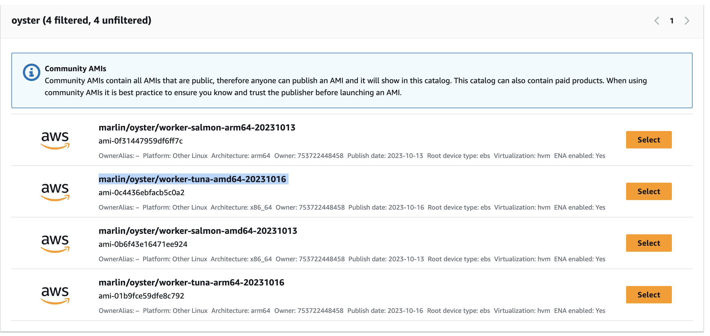
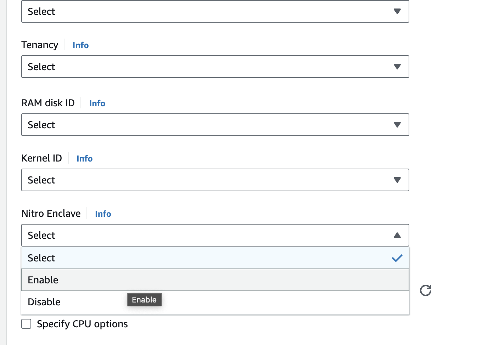

# Oyster Ollama Setup

Launch enclave compatible instance, like `marlin/oyster/worker-salmon-amd64-20231016`. 
Ensure instance has atleast `8vCPUs` and `16 GB Memory`



Nitro enclave are disabled by default, go the `Advanced` Section and enable them before launching your instance



### Log in
> ssh ubuntu@instance_ip

Increase the `memory_mib` to atleast `8000 MB` and `cpu_count` to atleast `4`.
Make sure the CPU count and memory in the build.sh script are within the range specified in the allocator.yaml file.

`vim /etc/nitro_enclaves/allocator.yaml`

```
---
# Enclave configuration file.
#
# How much memory to allocate for enclaves (in MiB).
memory_mib: 8000
#
# How many CPUs to reserve for enclaves.
cpu_count: 6
#
# Alternatively, the exact CPUs to be reserved for the enclave can be explicitly
# configured by using `cpu_pool` (like below), instead of `cpu_count`.
# Note: cpu_count and cpu_pool conflict with each other. Only use exactly one of them.
# Example of reserving CPUs 2, 3, and 6 through 9:
# cpu_pool: 2,3,6-9
~                   
```

### Clone the repo

```
git clone https://github.com/marlinprotocol/ollama_oyster_setup.git
```

### Build instance
```
chmod +x ./build.sh
./build.sh
```

### Connect Enclave

by default enclave can not be reached. apply the following command on host machine to make ports inside enclave reachable

```
sudo nft list ruleset

sudo nft add table ip nat

sudo nft add chain ip nat PREROUTING { type nat hook prerouting priority 0 \; }

sudo nft add rule ip nat PREROUTING iifname "ens5" tcp dport 80 counter redirect to :1200

sudo nft add rule ip nat PREROUTING iifname "ens5" tcp dport 443 counter redirect to :1200

sudo nft add rule ip nat PREROUTING iifname "ens5" tcp dport 1025-65535 counter redirect to :1200

```

### Test

Test using the `curl` from host machine
```
curl http://{{instance-ip}}:5000/api/generate -d '{
  "model": "tinyllama",
  "prompt":"Why is the sky blue?"
}'
```
